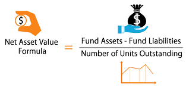
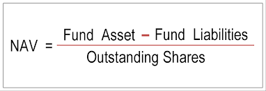

# NAV module for Hedge fund or Mutual fund managers

## Net Asset Value


At each tick that financial events are comming, we like to calculate and update NAV, although this process only
happens once a day in Iran! But for technical interests I use static methods in java together with 
observer pattern to achieve this goal.
Assume that two events are comming:
```java_holder_method_tree
 BondProtos.Bond.Builder asset1 = BondProtos.Bond.newBuilder().setName("farshadBond").setType("asset").setValue(5);
 Message builtMessage1=asset1.build();
 BondProtos.Bond.Builder asset2 = BondProtos.Bond.newBuilder().setName("betaBond").setType("liability").setValue(2);
 Message builtMessage2=asset2.build();
 MessageDispatcherImpl messageDispatcher=applicationContext.getBean(MessageDispatcherImpl.class);
 messageDispatcher.dispatchEvent("assets", builtMessage1);
 messageDispatcher.dispatchEvent("liabilities", builtMessage2);
```
So domain experts can just extend a class and inform the infrastructure which calculators need to be used
to update some financial variables such as NAV(net asset value).
```java
@DomainEventListener(ExtMessageClasses = {BondProtos.Bond.class} , calculatorNames = {"nav"})
public class BondListener extends AbstractMessageListener<BondProtos.Bond> {

    public void setSubject(MessageDispatcherImpl messageDispatcher){
        this.messageDispatcherImpl=messageDispatcher;
        this.messageDispatcherImpl.attach(this);
    }

    @Override
    public void handle(BondProtos.Bond message)  {
        System.out.println("handled bond successfully!");
        System.out.println("message.getName()="+message.getName());
        System.out.println("message.getValue()="+message.getValue());
    }
}
```

## Results
```java_holder_method_tree
found listener:com.farshad.domain.listeners.BondListener
putting calculators.....
2019-03-19 11:07:08.323  INFO 967 --- [           main] o.s.b.web.embedded.netty.NettyWebServer  : Netty started on port(s): 8081
2019-03-19 11:07:08.328  INFO 967 --- [           main] com.farshad.App                          : Started App in 2.539 seconds (JVM running for 3.809)
reflection once only!
name=farshadBond type=asset  value=5.0
new asset
nav at time:2019-03-19 11:07:08.377=1.6666666666666667
----------state change------------
handled bond successfully!
message.getName()=farshadBond
message.getValue()=5.0
name=betaBond type=liability  value=2.0
new liability
nav at time:2019-03-19 11:07:08.379=1.0
----------state change------------
handled bond successfully!
message.getName()=betaBond
message.getValue()=2.0
```
